<!-- ========================= -->
<!--      GITHUB PROFILE      -->
<!-- ========================= -->

<!-- ✅ TROCAR: banner -->
<!-- Você pode colocar um banner seu em /assets/banner.png -->

  

  

---
## 🔗 Connect with me

  <!-- ✅ TROCAR: link LinkedIn -->
  

  <!-- ✅ TROCAR: seu email -->
  

  <!-- ✅ TROCAR: link do portfólio -->
  

  <!-- ✅ TROCAR: link do WhatsApp (opcional) -->
  

---

## ⚡ Core Stack

  
  
  
  
  
  
  
  
  

## 📊 Stats

  <!-- ✅ TROCAR: username -->
  
  
  <!-- ✅ TROCAR: username -->
  

  <!-- ✅ TROCAR: username -->
  

---

## 📈 Contribution Activity

  <!-- ✅ TROCAR: username -->
  

